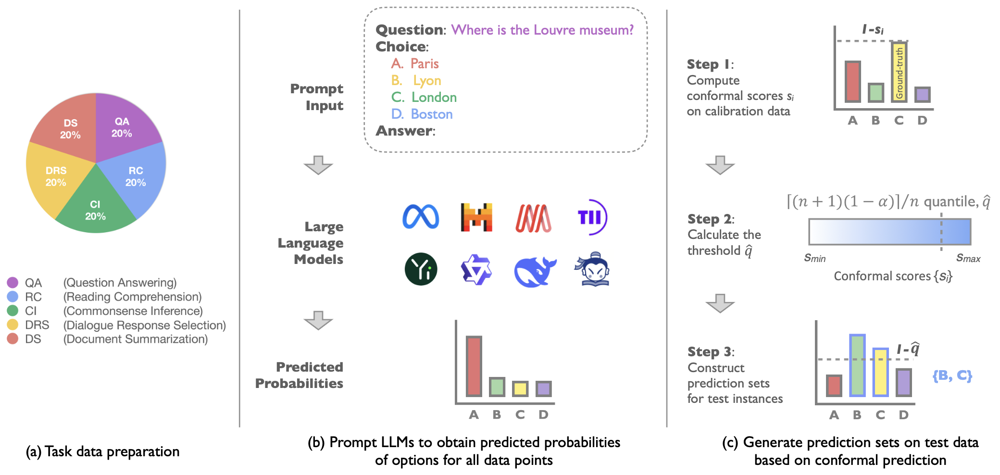
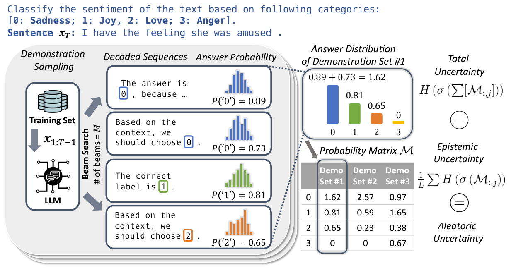

# Reproduction: Benchmarking LLMs via Uncertainty Quantification

In this project, we conducted a thorough analysis of the performance of large language models (LLMs) with a focus on prediction uncertainty. To quantify uncertainty, we employed [conformal prediction techniques](#conformal-prediction). We further delve into the uncertainty sources using [AU/EU decomposition](#aueu-decomposition) based on entropy values.

<div style="display:flex;">
    <div style="width:100%;float:left">
        Authors: Jerry Thomas John, Yijia Tang, Yacun Wang
    </div>
</div>

### Methods

Compared to other methods, conformal prediction is model-agnostic, distribution-free, and an statistically rigorous estimation of uncertainty. We adapted our code from [LLM-Uncertainty-Bench](https://github.com/smartyfh/LLM-Uncertainty-Bench). The pipeline is showed below:

<p align="center">
  
</p>

To compare across uncertainty scores and try to explain the sources of uncertainty, we utilized an entropy-based decomposition into Aleatoric Uncertainty (AU, data variations) and Epistemic Uncertainty (EU, model ambiguities). We adapted our code from [UQ_ICL](https://github.com/lingchen0331/UQ_ICL). The framework is showed below:

<p align="center">
  
</p>

### Environment

We have used `Python 3.10.13` with the following dependencies.
```shell
pip install -r requirements.txt
```

### Commands

#### Apply Conformal Prediction

To apply conformal prediction, first prompt LLMs to obtain logit outputs corresponding to all options (i.e. A, B, C, D, E, and F):

```shell
python generate_logits.py \
  --model={HuggingFace model directory} \
  --data_path=data \
  --file={name of dataset} \
  --prompt_method={base/shared/task} \
  --output_dir=outputs_base \
  --few_shot={1 for few-shot and 0 for zero-shot}
```

For example,

```shell
python generate_logits.py \
  --model=Qwen/Qwen-7B \
  --data_path=data \
  --file=mmlu_10k.json \
  --prompt_method=task \
  --output_dir=outputs_base \
  --few_shot=1
```

Then split each dataset into a calibration set and a test set, and apply conformal prediction to obtain prediction sets for all test set instances:

```shell
python uncertainty_quantification_via_cp.py \
  --model={model name} \
  --raw_data_dir=data \
  --logits_data_dir=outputs_base \
  --data_names={list of datasets to be evaluated} \
  --prompt_methods={list of prompt methods} \
  --icl_methods={icl1 for few-shot and icl0 for zero-shot} \
  --cal_ratio={calibration data percentage, e.g., 0.5} \
  --alpha={error rate, e.g., 0.1} \
  --calc-emotion={True if use SA, False otherwise}
```

For example,

```shell
python uncertainty_quantification_via_cp.py \
  --model=Qwen-7B \
  --raw_data_dir=data \
  --logits_data_dir=outputs_base \
  --data_names=mmlu_10k \
  --prompt_methods=task \
  --icl_methods=icl1 \
  --cal_ratio=0.5 \
  --alpha=0.1 \
  --calc-emotion=True
```

#### Apply AU/EU Decomposition

Here we could directly run:

```shell
python au_eu_decomposition.py \
  --model={model name} \
  --data_path=data \
  --file={name of dataset} \
  --num_data={number of data points to compute}
```

For example,

```shell
python au_eu_decomposition.py \
  --model=Qwen-7B \
  --data_path=data \
  --file=emotion_10k_4.json \
  --num_data=1000
```

---

### Citations

#### Conformal Prediction

```bibtex
@article{ye2024llm_uq,
  title={Benchmarking LLMs via Uncertainty Quantification},
  author={Ye, Fanghua and Yang MingMing and Pang, Jianhui and Wang, Longyue and Wong, Derek F and Yilmaz Emine and Shi, Shuming and Tu, Zhaopeng},
  journal={arXiv preprint arXiv:2401.12794},
  year={2024}
  }
```

#### AU/EU Decomposition

```bibtex
@inproceedings{
    ling2024uncertainty,
    title={Uncertainty Decomposition and Quantification for In-Context Learning of Large Language Models},
    author={Chen Ling and Xujiang Zhao and Wei Cheng and Yanchi Liu and Yiyou Sun and Xuchao Zhang and Mika Oishi and Takao Osaki and Katsushi Matsuda and Jie Ji and Guangji Bai and Liang Zhao and Haifeng Chen},
    booktitle={2024 Annual Conference of the North American Chapter of the Association for Computational Linguistics},
    year={2024},
    url={https://openreview.net/forum?id=Oq1b1DnUOP}
}
```
